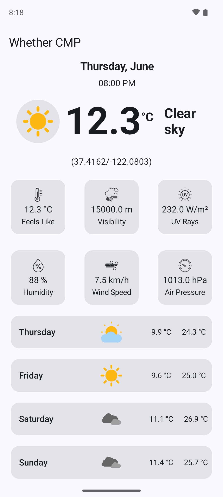
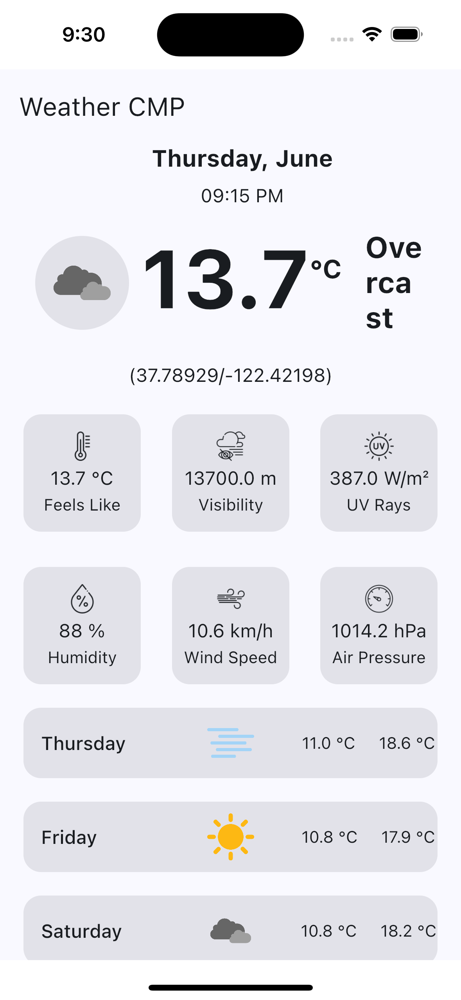

# 🌦️ WeatherApp

A sleek **Weather App** built using **Kotlin Multiplatform (KMP)** and **Compose Multiplatform (CMP)**. It fetches real-time weather data from the [Open-Meteo API](https://open-meteo.com/) and displays it in a modern, user-friendly interface.

> 🚀 Targets **Android** and **iOS**, sharing most logic and UI using KMM + CMP.

---

## ✨ Features

* 📍 Fetch weather based on **current device location**
* 🔍 View current weather and 7-day forecast
* 🌐 Real-time data from **Open-Meteo API**
* 🖼️ Unified, responsive UI with **Compose Multiplatform**
* 💾 Offline support via **RoomDB**
* 🧱 Follows **Clean Architecture principles**
* 💉 Dependency Injection using **Koin**
* 🔌 API handling with **Ktor**

---

## 📍 Location Support

* Uses **platform-specific location APIs**:

    * Android: Fused Location Provider
    * iOS: CoreLocation
* Retrieves latitude and longitude to fetch accurate weather data from Open-Meteo

---

## 🛠️ Tech Stack

| Layer                | Technology / Library              |
| -------------------- | --------------------------------- |
| UI                   | Compose Multiplatform             |
| Shared Logic         | Kotlin Multiplatform Mobile (KMM) |
| Networking           | Ktor                              |
| Dependency Injection | Koin                              |
| Local Storage        | RoomDB (KMM abstraction)          |
| Location Services    | Platform-specific (Android/iOS)   |

---

## 🧱 Architecture

The app uses a **modular Clean Architecture** approach:

* **Domain Layer**

    * Business logic (UseCases, Models, Interfaces)
* **Data Layer**

    * Ktor for network calls
    * RoomDB for offline caching
    * Mappers to convert between DTOs and domain models
* **Presentation Layer**

    * Compose Multiplatform UI
    * ViewModels for state handling
    * Platform-specific code for permissions, location, etc.

---

## 📦 Modules Overview

* `:shared` — Shared logic (domain, data, use-cases)
* `:androidApp` — Android-specific UI, permissions, and location handling
* `:iosApp` — iOS-specific Swift interop and CoreLocation integration

---

## 🌐 API Used

* [Open-Meteo API](https://open-meteo.com/en/docs)

Sample endpoint used:

```
https://api.open-meteo.com/v1/forecast?latitude=37.4220936&longitude=-122.083922&current=temperature_2m%2Crelative_humidity_2m%2Cweather_code%2Cwind_speed_10m%2Cvisibility%2Cpressure_msl%2Cis_day%2Cshortwave_radiation&daily=weather_code%2Ctemperature_2m_max%2Ctemperature_2m_min```

---

## 📸 Screenshots

<div align="center">
  
  
</div>

---

## 🚀 Getting Started

### Prerequisites

* Android Studio Giraffe or later
* Xcode 14+ with CocoaPods installed
* Kotlin Multiplatform Mobile plugin

### Clone the Repo

```bash
git clone https://github.com/your-username/weather-app-kmp.git
```

### Android

```bash
./gradlew :androidApp:installDebug
```

### iOS

Open `iosApp/iosApp.xcworkspace` in Xcode and run on a device or simulator.

---

## 📜 License

MIT License. See the `LICENSE` file for details.
